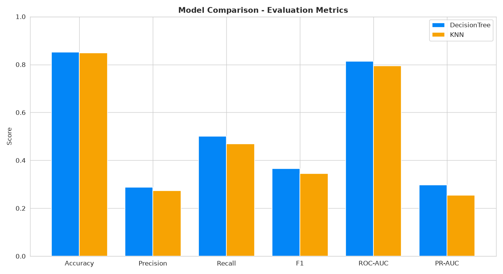

# Heart Disease Risk Prediction & Clinical Risk Analysis


A production-style machine-learning application that estimates a person's risk of
coronary heart disease from 17 routine clinical indicators. It began as an
exploratory Kaggle notebook (Decision Tree + K-Nearest Neighbors on the CDC
*Personal Key Indicators* dataset, ~320k records) and was rebuilt into a
deployable service: a trained, serialized **scikit-learn** pipeline served by a
**FastAPI** REST API, with prediction logging, asynchronous batch scoring, a
**React + TypeScript** UI, and full container orchestration.

> **Disclaimer.** Educational / portfolio project. This is **not a medical
> device** and must not be used for diagnosis or treatment decisions.

---

## Table of contents

- [Highlights](#highlights)
- [Architecture](#architecture)
- [Tech stack](#tech-stack)
- [Quickstart](#quickstart)
- [Project structure](#project-structure)
- [Machine learning](#machine-learning)
- [API reference](#api-reference)
- [Configuration](#configuration)
- [Testing](#testing)
- [Deployment](#deployment)
- [Notebook](#notebook)
- [Design notes](#design-notes)

---

## Highlights

- **End-to-end and reproducible** — a single command trains, tunes, evaluates,
  and serializes the model; the API loads that exact artifact to serve
  predictions.
- **Handles class imbalance honestly** — the target is only ~8.5% positive, so
  the pipeline uses balanced class weights and a **decision threshold tuned to
  maximize F1** (not a naive 0.5), and is judged on precision / recall / F1 /
  ROC-AUC rather than misleading accuracy.
- **No data leakage** — every transform (feature engineering, scaling, encoding)
  lives *inside one* scikit-learn `Pipeline`, is fit only on training folds, and
  is serialized whole, so training and serving apply identical preprocessing.
- **Single source of truth** — the feature schema and allowed categorical values
  are defined once in `heart_ml/config.py`; the API request models and the
  frontend dropdowns mirror it, and an import-time guard fails fast if they ever
  drift apart.
- **Graceful degradation** — runs with zero external infrastructure (SQLite +
  synchronous batch) for local dev and single-container hosting, or the full
  PostgreSQL + Redis + Celery topology via Docker Compose.
- **Well tested** — property-based tests (Hypothesis) plus unit, integration, and
  component tests (pytest + Vitest): **68 Python + 8 frontend** tests.
- **Deployable anywhere** — Docker Compose for the full stack, and a
  single-container image + Render blueprint for free one-click hosting.

---

## Architecture

```
                    ┌──────────────────────────┐
                    │  React + TS + Vite (SPA)  │
                    │  TanStack Query           │
                    └────────────┬─────────────┘
                                 │  /api/v1/*  (nginx proxy)
                                 ▼
   ┌───────────────────────────────────────────────────────┐
   │                    FastAPI  (api)                       │
   │  Pydantic validation · /predict · /batch · /health      │
   │  ┌───────────────┐   loads   ┌──────────────────────┐   │
   │  │ PredictionSvc │ ◀──────── │ model.joblib bundle  │   │
   │  └───────────────┘           │ (sklearn Pipeline +  │   │
   │        │                     │  tuned threshold)    │   │
   │        │ log                 └──────────────────────┘   │
   └────────┼───────────────────────────┬───────────────────┘
            ▼                            │ enqueue batch
   ┌─────────────────┐          ┌────────▼────────┐   ┌──────────────┐
   │  PostgreSQL     │          │  Redis (broker) │◀─▶│ Celery worker │
   │  predictions    │          └─────────────────┘   │ batch_predict │
   │  (SQLAlchemy /  │◀───────────────────────────────┤  logs results │
   │   Alembic)      │                                 └──────────────┘
   └─────────────────┘

   The shared `heart_ml` library is installed into both the API and the worker,
   guaranteeing identical feature engineering / preprocessing at train and serve
   time.
```

---

## Tech stack

| Layer            | Technologies |
|------------------|--------------|
| Machine learning | scikit-learn, pandas, NumPy, joblib, Matplotlib, Seaborn |
| Backend          | FastAPI, Pydantic v2, SQLAlchemy 2.0, Alembic, Celery, Redis |
| Database         | PostgreSQL (SQLite for zero-infra local dev) |
| Frontend         | React, TypeScript, Vite, TanStack Query |
| Infrastructure   | Docker, Docker Compose, nginx |
| Testing          | pytest, Hypothesis (property-based), Vitest, React Testing Library |

---

## Quickstart

### Option 1 — Full stack with Docker Compose (recommended)

Brings up PostgreSQL, Redis, the API, a Celery worker, and the frontend. The
model is trained during the image build, so no extra setup is needed.

```bash
cp .env.example .env          # then set POSTGRES_PASSWORD
docker compose up --build
```

| Service   | URL                              |
|-----------|----------------------------------|
| Frontend  | http://localhost:3000            |
| API docs  | http://localhost:8000/docs       |
| Health    | http://localhost:8000/api/v1/health |

### Option 2 — Single container (what gets deployed online)

Bundles the frontend into the API and uses SQLite + synchronous batch, so it
needs no external services — ideal for a free one-service host.

```bash
docker build -f Dockerfile.web -t heart-web .
docker run --rm -p 8000:8000 heart-web
# UI, API, and /docs all on http://localhost:8000
```

### Option 3 — Local dev (no Docker)

Requires Python 3.10+ and Node 18+.

```bash
# 1) Train the model
pip install -e .
python -m heart_ml.train            # writes heart_ml/artifacts/model.joblib

# 2) Run the API
pip install -r backend/requirements.txt
cd backend && uvicorn app.main:app --reload --port 8000

# 3) Run the frontend (separate terminal)
cd frontend && npm install && npm run dev   # http://localhost:5173
```

---

## Project structure

```
heart/
├── heart_ml/                     # Shared ML library (used by training AND the API)
│   ├── config.py                 #   Feature lists + allowed category values (source of truth)
│   ├── data.py                   #   Dataset loading / target extraction
│   ├── features.py               #   FeatureEngineer transformer
│   ├── pipeline.py               #   ColumnTransformer + DT/KNN pipelines
│   ├── train.py                  #   Train, tune, compare, serialize, plot
│   └── artifacts/                #   model.joblib, metrics.json, comparison.csv, plots/
├── backend/                      # FastAPI service
│   ├── app/
│   │   ├── main.py               #   App + lifespan (warm-load model, serve SPA if present)
│   │   ├── core/                 #   Settings (pydantic-settings) + API-key security
│   │   ├── schemas.py            #   Pydantic request/response models + drift guard
│   │   ├── ml.py                 #   Thread-safe model-serving layer
│   │   ├── db.py / models.py     #   SQLAlchemy engine + Prediction (audit) table
│   │   ├── celery_app.py/tasks.py#   Async batch scoring
│   │   └── routers/              #   health, predict, batch
│   ├── alembic/                  #   Database migrations
│   └── requirements.txt
├── frontend/                     # React + TypeScript (Vite) SPA
├── tests/                        # heart_ml library tests (pytest + Hypothesis)
├── heart-disease-prediction-other.ipynb   # Modernized EDA + modeling notebook
├── heart_2020_cleaned.csv        # CDC dataset (~320k rows)
├── docker-compose.yml            # Full multi-service stack
├── Dockerfile.web                # Single-container image (frontend + API)
├── render.yaml                   # Free one-click deploy blueprint
└── pyproject.toml                # Installable heart_ml package + tooling config
```

---

## Machine learning

### Data

The CDC *Personal Key Indicators of Heart Disease* dataset — ~320,000 survey
responses with 17 features (4 numeric, 13 categorical). The target
`HeartDisease` is highly imbalanced at **~8.5% positive**, which drives most of
the modeling decisions below.

### Pipeline

1. **Feature engineering** (`FeatureEngineer`) — adds clinically motivated
   features: `TotalUnhealthyDays` (physical + mental unwell days),
   `SleepDeviation` (distance from ~7h of sleep), and `IsObese` (BMI ≥ 30).
2. **Preprocessing** — `StandardScaler` on numeric/engineered columns and
   `OneHotEncoder(handle_unknown="ignore")` on categoricals, wrapped in a
   `ColumnTransformer`. Fit on training data only.
3. **Model** — Decision Tree (with `class_weight="balanced"`) and KNN, each tuned
   with `GridSearchCV` (3-fold, scored on average precision / PR-AUC).
4. **Threshold tuning** — the decision threshold is chosen to maximize F1 on a
   validation split rather than defaulting to 0.5.
5. **Selection & serialization** — the model with the best F1 is retrained and
   saved as a self-contained bundle (pipeline + threshold + metadata).

### Results

Held-out 20% test set (`random_state=44`), metrics at each model's tuned
threshold:

| Model                        | Accuracy | Precision | Recall | F1        | ROC-AUC   | PR-AUC |
|------------------------------|:--------:|:---------:|:------:|:---------:|:---------:|:------:|
| **Decision Tree** (deployed) |  0.851   |   0.288   | 0.501  | **0.366** | **0.814** | 0.297  |
| K-Nearest Neighbors          |  0.848   |   0.273   | 0.468  |   0.345   |   0.795   | 0.254  |

The Decision Tree is selected and served: it wins on F1 / ROC-AUC and is tiny
and fast at inference. Comparison plots are generated to
`heart_ml/artifacts/plots/`:



> **Why not just accuracy?** Predicting "no disease" for everyone scores ~91%
> accuracy yet catches zero at-risk patients. The balanced, threshold-tuned
> pipeline instead recovers **~50% recall** on the positive class — far more
> useful for a screening tool — which is the metric that matters here.

Retrain any time with `python -m heart_ml.train` (`--sample N` to cap training
rows, `--no-plots` to skip figures).

---

## API reference

Base path: `/api/v1` · interactive docs at `/docs` (Swagger) and `/redoc`.

| Method | Endpoint            | Description |
|--------|---------------------|-------------|
| GET    | `/health`           | Liveness + whether the model and async worker are available |
| GET    | `/health/model`     | Deployed model metadata and evaluation metrics |
| POST   | `/predict`          | Score one patient (result is logged to the database) |
| POST   | `/batch`            | Score many patients (async via Celery, or inline if no broker) |
| GET    | `/batch/{task_id}`  | Poll the status/result of an async batch job |

```bash
curl -X POST http://localhost:8000/api/v1/predict \
  -H 'Content-Type: application/json' \
  -d '{"BMI":40,"Smoking":"Yes","AlcoholDrinking":"No","Stroke":"Yes",
       "PhysicalHealth":20,"MentalHealth":10,"DiffWalking":"Yes","Sex":"Male",
       "AgeCategory":"80 or older","Race":"White","Diabetic":"Yes",
       "PhysicalActivity":"No","GenHealth":"Poor","SleepTime":4,
       "Asthma":"Yes","KidneyDisease":"Yes","SkinCancer":"Yes"}'
```

```json
{
  "id": 1,
  "prediction": 1,
  "risk_label": "At risk",
  "probability": 0.9697,
  "threshold": 0.7056,
  "model_name": "DecisionTree",
  "trained_at": "2026-07-22T07:56:39+00:00"
}
```

Requests are validated by Pydantic: all 17 fields are required, numeric fields
are range-checked (e.g. `BMI` 10–100, `SleepTime` 0–24), and categorical fields
must be one of their allowed values — otherwise the API returns `422`.

---

## Configuration

All settings are read from environment variables (or a `.env` file).

| Variable | Default | Purpose |
|----------|---------|---------|
| `DATABASE_URL` | `sqlite:///./heart.db` | SQLAlchemy connection string (use a `postgresql+psycopg2://…` URL in production) |
| `REDIS_URL` | *(empty)* | Enables Celery async batch; empty → batch runs synchronously |
| `API_KEY` | *(empty)* | If set, `/predict` and `/batch` require the `X-API-Key` header |
| `CORS_ORIGINS` | `*` | Comma-separated list of allowed origins |
| `ENVIRONMENT` | `development` | `production` logs a warning if no `API_KEY` is set |
| `HEART_TRAIN_SAMPLE` | `40000` | Stratified cap on training rows (keeps training fast) |

---

## Testing

```bash
make test        # Python + frontend
make test-py     # pytest (heart_ml + backend), Hypothesis profile >= 100 examples
make test-ui     # Vitest component tests
```

The suite pairs **property-based tests** (Hypothesis) for input-varying logic —
serialization round-trips, decision-rule and threshold invariants, validation
rejection — with focused unit, integration, and component tests for fixed
behavior, error paths, persistence, and the UI.

---

## Deployment

The single-container image (`Dockerfile.web`) bundles the frontend into the API
and relies on the built-in SQLite + synchronous-batch fallbacks, so it needs no
external services — ideal for a free one-service host.

### Render (one-click)

`render.yaml` is a ready Blueprint:

1. Push this repository to GitHub.
2. In Render: **New + → Blueprint** → select the repo. Render builds
   `Dockerfile.web` and deploys it.
3. Open the service URL. Health check path: `/api/v1/health`.

Free-tier notes: the service sleeps after ~15 min idle (first request
cold-starts in ~30–60s) and SQLite is ephemeral (history resets on redeploy).
Render injects `$PORT`; the image already honors it.

### Alternatives

- **Hugging Face Spaces** (Docker SDK) — point the Space at `Dockerfile.web` and
  set the app port to `7860`.
- **Fly.io / Koyeb** — deploy the same `Dockerfile.web`.
- **Any VPS** — run the full multi-service stack with `docker compose up -d`.

### Security note

The public demo runs with **no API key** (a same-origin SPA cannot keep a secret
client-side). Set `API_KEY` to require the `X-API-Key` header when the API sits
behind a trusted caller rather than a public browser app.

---

## Notebook

`heart-disease-prediction-other.ipynb` is the original Kaggle EDA + modeling
notebook, modernized to run on Python 3.12 with current scikit-learn / pandas /
seaborn, and with the test-set data-leakage bug fixed (the scaler and encoder
are no longer re-fit on the test data). Run it top to bottom to reproduce the
exploratory analysis and the baseline models.

---

## Design notes

- **Model choice.** Decision Tree and KNN are trained and compared on every run;
  the Decision Tree is deployed because it achieves the best F1 on the held-out
  test set while staying small and fast to serve. The training code is
  model-agnostic, so more estimators can be added with minimal changes to
  `heart_ml/pipeline.py` and `heart_ml/train.py`.
- **One source of truth.** Feature columns and allowed categorical values live in
  `heart_ml/config.py`; the API schema and the frontend dropdowns mirror them,
  and an import-time check fails fast if they ever drift apart.
- **Patient-facing UI.** The web interface intentionally shows only the inputs
  and the resulting risk — model internals (name, threshold) are available via
  the API's `/health/model` endpoint for operators, not the end user.
